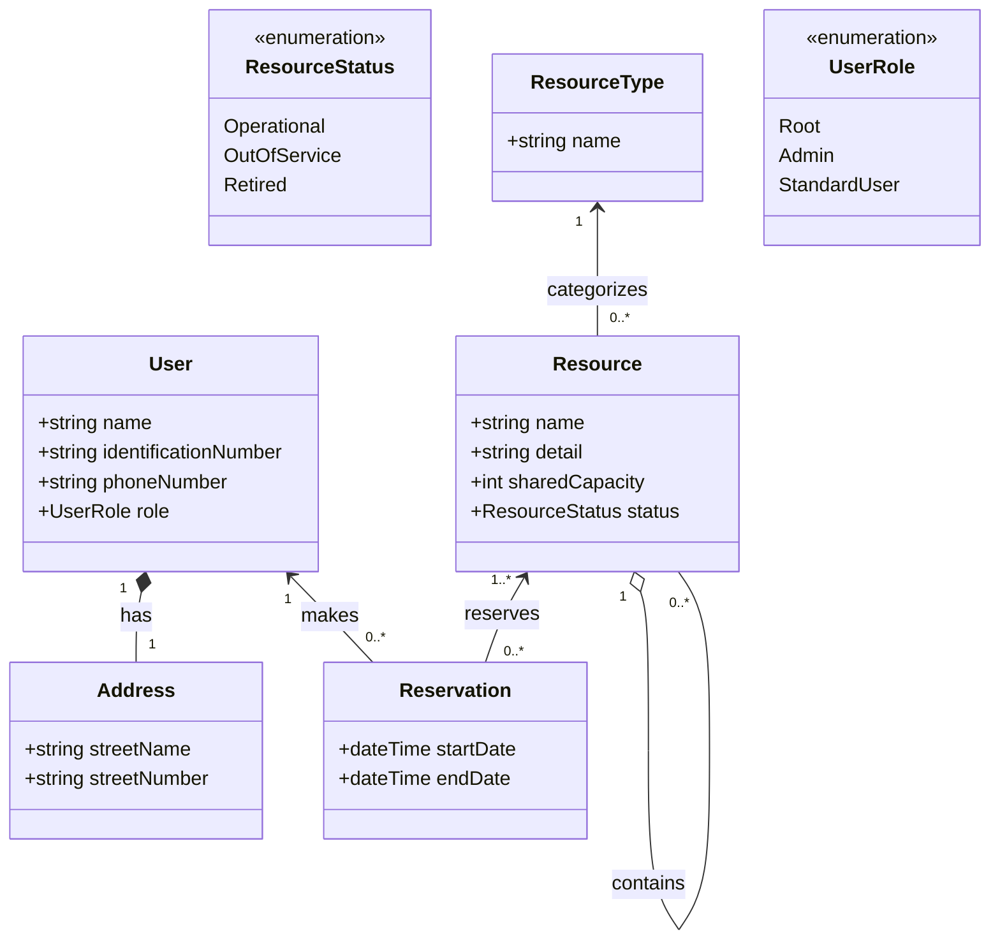

Diagrama de Entidades.

```mermaid
classDiagram
direction TB
    class Resource {
	    +string name
	    +string detail
	    +int sharedCapacity
	    +ResourceStatus status
    }

    class ResourceStatus {
	    Operational
	    OutOfService
	    Retired
    }

    class ResourceType {
	    +string name
    }

    class User {
	    +string name
	    +string identificationNumber
	    +string phoneNumber
	    +UserRole role
    }

    class UserRole {
	    Root
	    Admin
	    StandardUser
    }

    class Address {
	    +string streetName
	    +string streetNumber
    }

    class Reservation {
	    +dateTime startDate
	    +dateTime endDate
    }

	<<enumeration>> ResourceStatus
	<<enumeration>> UserRole

    Resource "1" o-- "0..*" Resource : contains
    ResourceType "1" <-- "0..*" Resource : categorizes
    User "1" *-- "1" Address : has
    User "1" <-- "0..*" Reservation : makes
    Resource "1..*" <-- "0..*" Reservation : reserves
```
