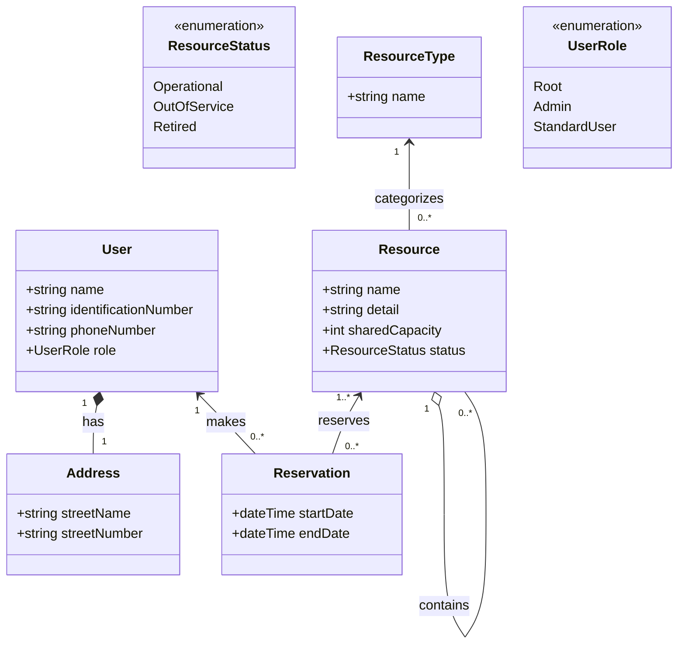

Entities Diagram.


User Case.
```mermaid
usecase-beta
actor User("User")
actor Admin("Admin")
Login("Log in")
ManageUsers("Manage users")
ManageOwnUserProfile("Manage user's own profile")
ManageResources("Manage resources")
ViewAvailableResources("View available resources")
ManageReservations("Manage reservations")
ManageOwnReservations("Manage user's reservations")
User --> Login
User --> ManageOwnUserProfile
User --> ViewAvailableResources
User --> ManageOwnReservations
Admin --> ManageUsers
Admin --> ManageResources
Admin --> ManageReservations
```

